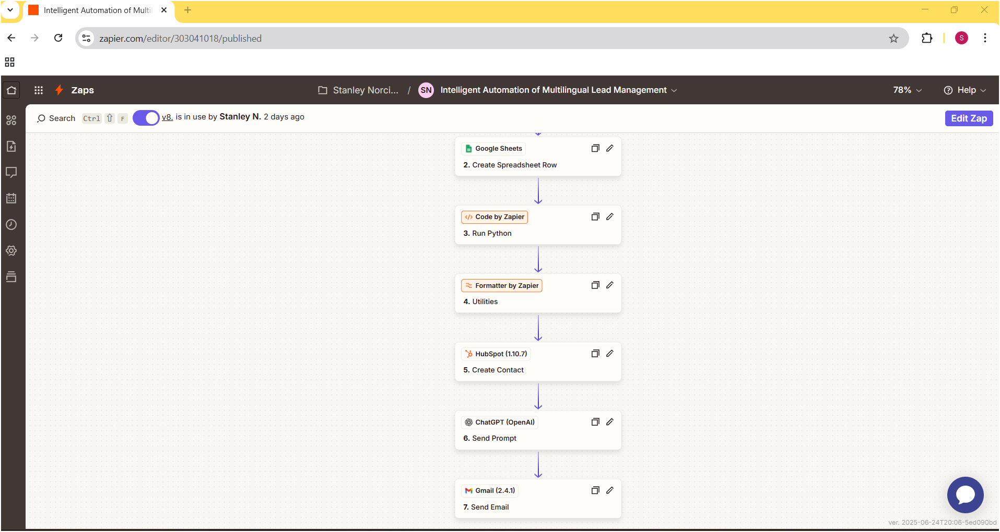
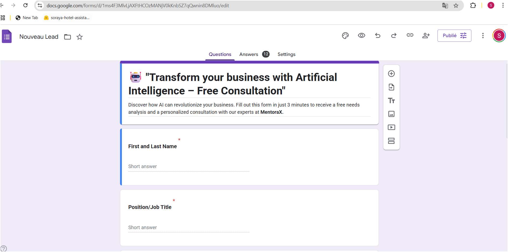
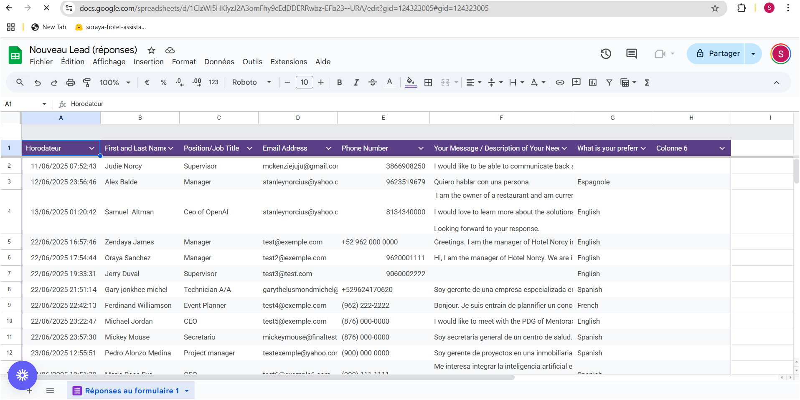
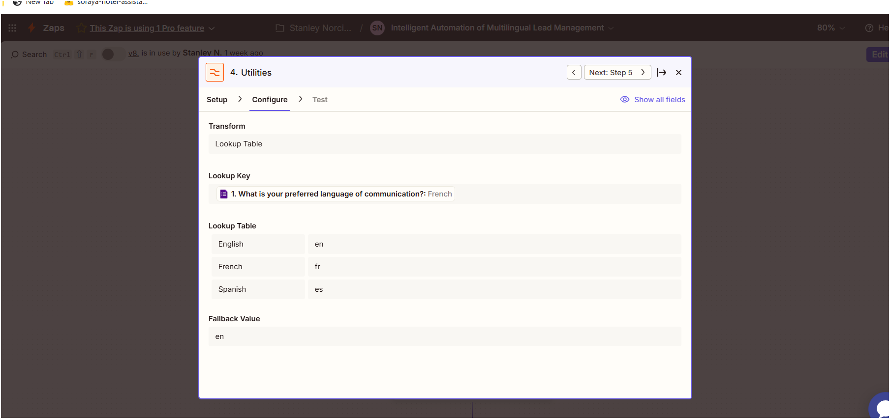
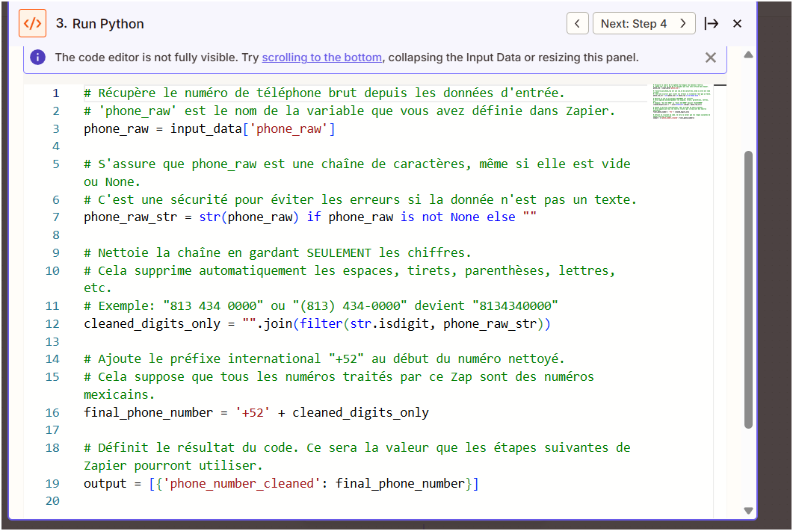
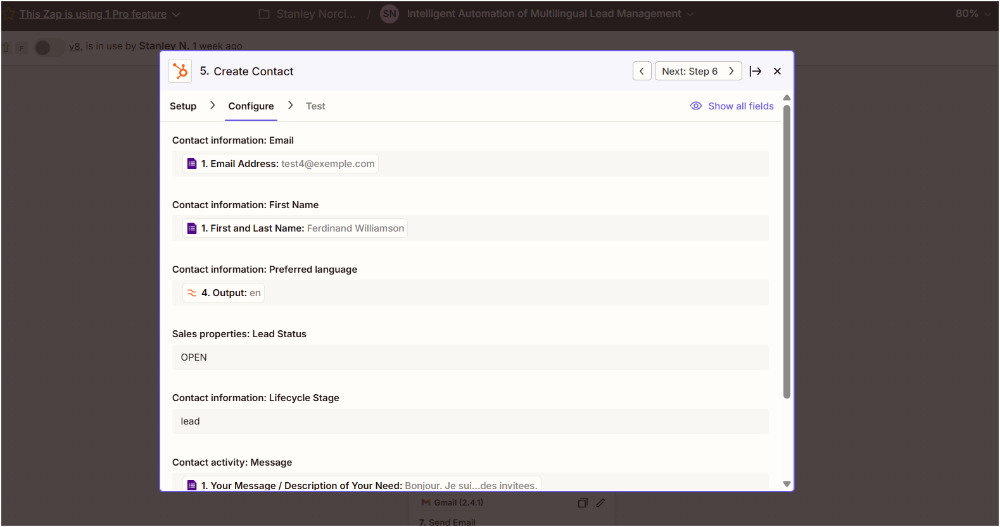
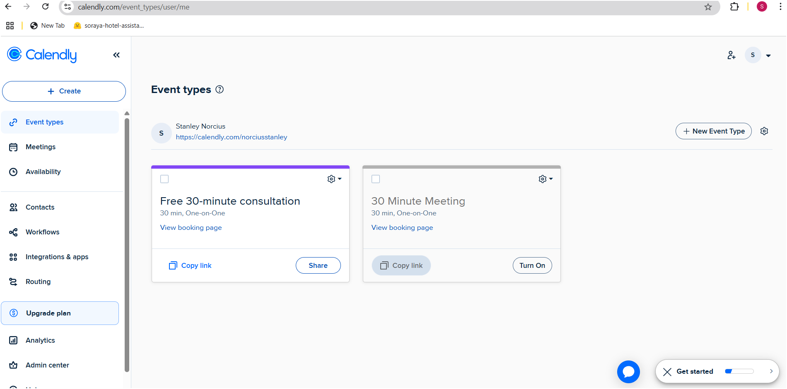
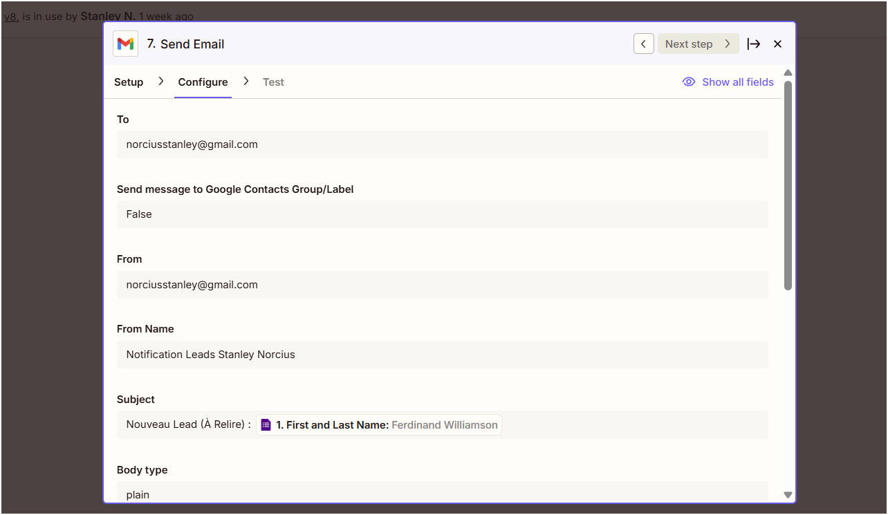

# lead-automation-zapier-hubspot
Personalized Email Responses using GPT, Zapier, Python, Google Sheets &amp; HubSpot
# 🚀 Request Automation System: From Capture to Personalized Communication

**Optimizing lead management and customer engagement processes with AI and automation.**

---

## 💡 Project Overview

This project aims to transform inbound inquiry management into a fully automated and personalized process. By leveraging artificial intelligence and no-code/low-code tools, it ensures efficient data collection, intelligent processing, and instant, tailored communication to meet each lead's needs.

---

## 🎯 The Manual Process Challenge

Service and communication teams waste valuable time on repetitive tasks:
* 📝 Manual form data collection and entry.
* 📧 Generic or delayed responses leading to low engagement satisfaction.
* 📊 Inconsistent inquiry qualification and follow-up.
* 🔗 Fragmented tracking of interactions and communications.

---

## ✨ The Intelligent Automation Solution

I designed and implemented an intelligent automation system that precisely collects, analyzes, personalizes, and manages inquiries. This solution allows teams to focus on direct assistance and high-value interactions, reducing administrative burden.

---

## ⚙️ Technical Architecture

#### Data Ingestion & Pre-processing:
* Google Forms (Data Capture)
* Google Sheets (Form Data Storage)
* Python (Data Cleaning & Formatting via Zapier)
* Zapier Formatter (Data Standardization)

#### CRM & AI Processing:
* HubSpot (Lead/Contact Management)
* OpenAI (AI-Powered Content Generation)

#### Engagement & Delivery:
* Gmail (Personalized Email Dispatch)
* Calendly (Automated Appointment Scheduling)

---

## 🔑 Key Features

#### Intelligent Data Processing
* 📥 Capture and consolidation of form data from various inputs.
* 🧹 Automated data cleansing and formatting (e.g., Python scripts for standardization).
* 🗄️ Data organization and management in CRM (HubSpot).
* 🔍 Identification of key user needs or service requests.

#### Automated Personalized Communication
* 🤖 Personalized email responses generated by AI (OpenAI).
* 💬 Multi-channel communication (email, and potential follow-up via CRM).
* 🤝 Efficient routing of inquiries for human support when needed.

---

## 📊 Impact and Results

#### Performance Metrics
* ✅ **Significant increase in user engagement:** Improved interaction and response rates to personalized communications.
* ✅ **Reduced request processing time:** Accelerated management of forms and sending of initial responses.
* ✅ **Improved quality of collected data:** Thanks to automated cleansing and formatting.
* ✅ **Optimized operational efficiency:** Freeing up team time for high-value interactions.

#### Key Advantages
* 🌟 **Personalized communication at scale:** Ability to deliver relevant and individualized messages.
* 🛡️ **Data accuracy and consistency:** Minimizing manual errors and standardizing information.
* 🔗 **Seamless integration with existing tools:** Harmonious connection with Google Sheets, HubSpot, and Gmail.
* 📈 **Scalability of request management:** Solution capable of handling a growing volume of inquiries efficiently.

---

## 🎬 System Demonstration

[INSERT DEMO VIDEO ]
*(E.g., Watch the complete automation cycle: From data collection to personalized communication, see how AI transforms raw inquiries into meaningful interactions.)*

---

## 🌐 Project Resources

* 💡 **View Detailed Architecture:** https://www.notion.so/Stanley-Norcius-Junior-AI-Developer-Python-Chatbots-Automation-21f37c22bf7380fb9fdcc2bd868f7c29?source=copy_link#21f37c22bf73803b8900de4c90e3b816
* 📈 **Explore Performance Metrics:** https://www.notion.so/Stanley-Norcius-Junior-AI-Developer-Python-Chatbots-Automation-21f37c22bf7380fb9fdcc2bd868f7c29?source=copy_link#21f37c22bf738030af45edc3a15ea45b
* 📄 **Complete Workflow Documentation:** https://www.notion.so/Stanley-Norcius-Junior-AI-Developer-Python-Chatbots-Automation-21f37c22bf7380fb9fdcc2bd868f7c29?source=copy_link#21f37c22bf738017aa69d5bb0fed7ed4
* 🖼️ **Zapier Workflow Screenshots:**assets/screenshots

* ## 🖼️ Workflow Screenshots

Here are some visual overviews of the key steps in the Zapier automation.

### Zap Overview

*This screenshot shows the complete sequence of steps in Zapier, from trigger to final action.*

### Google Forms - Lead Capture

*This screenshot shows the Google Forms interface where leads submit their inquiries.*

### Google Sheets - Data Storage

*An overview of the Google Sheet where raw lead data is initially stored.*

### Zapier Formatter - Data Standardization

*An example of the Zapier Formatter step used for data standardization (e.g., language code conversion).*

### Python Data Cleaning

*An overview of the 'Code by Zapier' step where the Python script cleans phone numbers.*

### Contact Created in HubSpot

*An example of a contact automatically created in HubSpot, with correctly mapped data.*

### Calendly - Automated Appointment Scheduling

*A view of the Calendly scheduling page, demonstrating the seamless appointment booking process for leads.*

### Notification Email

*The internal notification email received, including lead details and the AI-generated email draft.*
Added Zapier workflow screenshots to the assets/screenshots folder

💻 Python Code
Here is the Python code snippet used within Zapier for cleaning and formatting phone numbers.

# Retrieves the raw phone number from the input data.
 'phone_raw' is the variable name you defined in Zapier.
phone_raw = input_data['phone_raw']

# Ensures that phone_raw is a string, even if it's empty or None.
 This is a safety measure to prevent errors if the data is not text.
phone_raw_str = str(phone_raw) if phone_raw is not None else ""

# Cleans the string by keeping ONLY digits.
 This automatically removes spaces, hyphens, parentheses, letters, etc.
 Example: "813 434 0000" or "(813) 434-0000" becomes "8134340000"
cleaned_digits_only = "".join(filter(str.isdigit, phone_raw_str))

# Adds the international prefix "+52" to the beginning of the cleaned number.
 This assumes that all numbers processed by this Zap are Mexican phone numbers.
final_phone_number = '+52' + cleaned_digits_only

# Defines the output of the code. This will be the value that subsequent Zapier steps can use.
output = [{'phone_number_cleaned': final_phone_number}]
---

## 🛠️ Technologies Used

* **Google Forms**
* **Google Sheets**
* **Zapier**
* **Python**
* **HubSpot CRM**
* **OpenAI (ChatGPT API)**
* **Gmail**
* **Calendly**

---

## 🤝 Contact

For any questions, collaborations, or opportunities, feel free to reach out:
* **LinkedIn:** www.linkedin.com/in/stanley-norcius-167278186
* **Email:** norciusstanley@gmail.com
